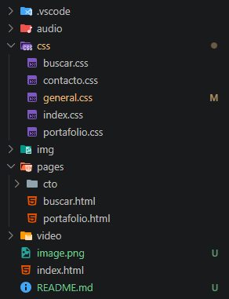
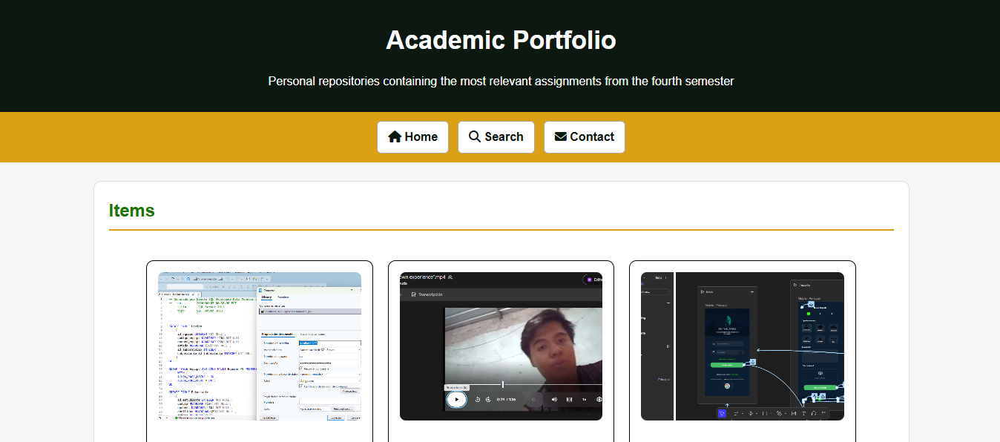
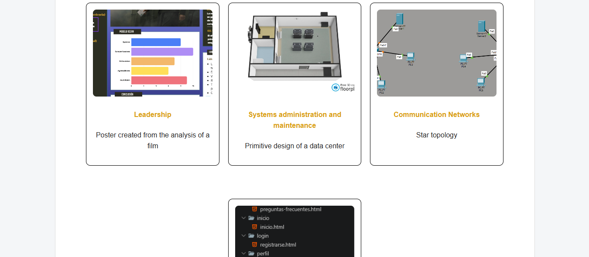
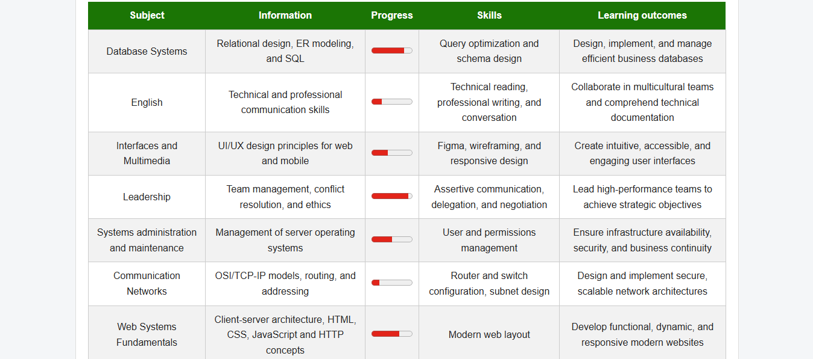
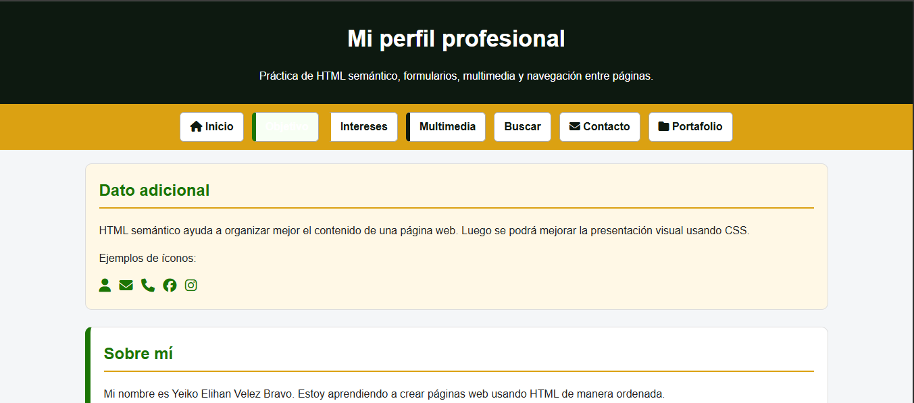
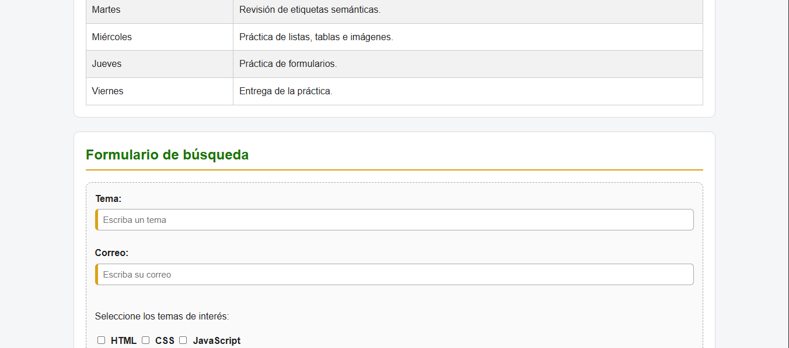

# Practic 01

# Purpose of the website
The purpose of the website is to learn HTML, with each expansion providing new knowledge of tags or in this case CSS.

# Structure

# Screenshots

# Technologies used
HTML
CSS

# Author information
Yeiko Velez - yeivelezbravo16@gmail.com